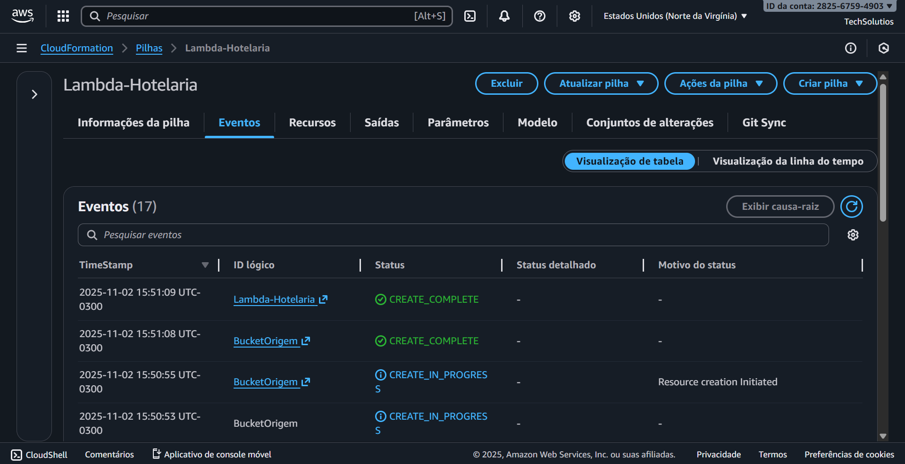

# Desafio: Tarefas Automatizadas com Lambda Function e S3 (via CloudFormation)

Este repositório documenta a implementação do desafio do bootcamp: um workflow serverless para automatizar tarefas usando AWS Lambda e Amazon S3.

## 1. Objetivo

O objetivo deste desafio foi consolidar o conhecimento em arquitetura orientada a eventos. Para ir além, decidi provisionar **toda a infraestrutura como código (IaC)**, usando o **AWS CloudFormation** para automatizar a criação de todos os recursos necessários.

## 2. Cenário Prático: Processador de Descrições (Sistema de Hotelaria)

Implementei um processo 100% automatizado para o Sistema de Hotelaria:

1.  **Evento (Gatilho):** Um administrador faz upload de um arquivo `.txt` (contendo a descrição de um quarto, por exemplo) para um S3 Bucket de "origem".
2.  **Tarefa (Lambda):** Uma função Lambda é disparada automaticamente, lê o conteúdo do arquivo de texto, converte todo o conteúdo para **MAIÚSCULAS** e salva o resultado em um segundo S3 Bucket de "destino".

## 3. A Implementação: Uma Jornada de Depuração (Debugging)

Este desafio foi o mais complexo, pois envolveu depurar o próprio template do CloudFormation. A stack não foi criada na primeira tentativa.

### O Erro Principal: "Erro de formato do modelo (Erro do analisador)"

Ao tentar fazer o upload do meu template `lambda-s3-stack.yaml`, o CloudFormation falhou antes mesmo de criar qualquer recurso. A aba "Eventos" não ajudava, pois o próprio arquivo YAML estava quebrado.

* **Causa 1:** Um erro de sintaxe onde um recurso (`BucketOrigem`) foi definido duas vezes no mesmo template.
* **Causa 2 (A mais difícil):** Mesmo após corrigir a duplicata, o erro de "bad indentation of a mapping entry" persistiu. Isso foi causado por caracteres especiais, acentos (ex: `ç`, `ã`) ou espaços inválidos nas linhas de `Description:` do template, que provavelmente foram copiados de forma incorreta.
* **Solução:** A única solução foi **remover todas as linhas de `Description:` e todos os comentários** do arquivo YAML, criando um template 100% "limpo", contendo apenas o código de infraestrutura funcional.

### O Sucesso: Stack `Lambda-Hotelaria`

Após limpar o template, o CloudFormation finalmente conseguiu analisar e executar o arquivo. A stack (que chamei de `Lambda-Hotelaria`) foi criada com sucesso, provisionando todos os 17 recursos em poucos minutos.

## 4. Arquitetura Provisionada (Tudo via IaC)

O arquivo `lambda-s3-stack.yaml` (a versão "limpa") criou automaticamente:

1.  **`BucketDestino`:** O S3 Bucket para os arquivos processados.
2.  **`LambdaS3Role`:** A Role (função) IAM com permissões para o Lambda ler/escrever no S3 e criar logs.
3.  **`FuncaoProcessadora`:** A função Lambda com o código Python 3.9 embutido (`inline`) para converter o texto.
4.  **`PermissaoS3InvocarLambda`:** A permissão que permite ao S3 "chamar" a função Lambda.
5.  **`BucketOrigem`:** O S3 Bucket de origem, já configurado com a `NotificationConfiguration` (o "gatilho" ou "trigger") para disparar o Lambda em qualquer upload de `.txt`.

## 5. Teste de Ponta-a-Ponta

Para validar a automação:

1.  Criei um arquivo local `teste.txt` com o conteúdo: `reserva do quarto 712`.
2.  Fiz o upload de `teste.txt` para o `BucketOrigemNome` (criado pela stack).
3.  Imediatamente, verifiquei o `BucketDestinoNome`.
4.  Um novo arquivo, `processado-teste.txt`, apareceu.
5.  Ao baixar e abrir, o conteúdo era: `RESERVA DO QUARTO 712`.

**A automação foi um sucesso!**

## 6. Conclusão

Este desafio foi o mais completo, pois uniu múltiplos conceitos:
* Arquitetura Serverless (S3 + Lambda).
* Arquitetura Orientada a Eventos (Triggers do S3).
* Gerenciamento de Permissões (IAM Roles e Policies).
* Infraestrutura como Código (CloudFormation).

O maior aprendizado, sem dúvida, foi a importância da **depuração (debugging)**. Entender que um "Erro do analisador" é um problema no *arquivo* (e não na *lógica* da nuvem) foi crucial para resolver o problema e finalizar todos os desafios do bootcamp.
